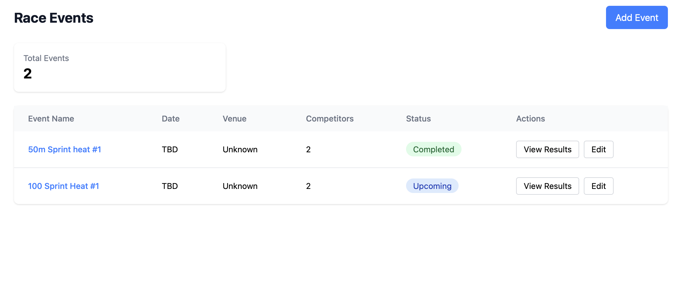

# LiveHeats Project

Welcome to the **LiveHeats** project! This guide provides instructions on setting up the project, installing dependencies, running the application, and executing tests.



🔗 **Live Demo:** [https://live-heats.vercel.app/](https://live-heats.vercel.app/)

## 📌 Project Requirements

For a detailed list of features and requirements, see [Project Requirements](Requirements.md).

---

## 📌 Table of Contents
- [🛠 Prerequisites](#-prerequisites)
- [🚀 Project Setup](#-project-setup)
- [💻 Running the Application](#-running-the-application)
- [🧪 Running Tests](#-running-tests)

---

## 🛠 Prerequisites

Before starting, ensure you have the following installed:

- **[Node.js](https://nodejs.org/)** (version 18 or higher)
- **[npm](https://www.npmjs.com/)** (comes with Node.js)

---

## 🚀 Project Setup

1. **Clone the Repository:**
   ```bash
   git clone https://github.com/dawilster/liveheats.git
   cd liveheats
   ```

2. **Install Dependencies:**
   ```bash
   npm install
   ```

3. **Verify Installation:**
   ```bash
   node -v   # Check Node.js version
   npm -v    # Check npm version
   ```

---

## 💻 Running the Application

To start the development server, run:

```bash
npm run dev
```

This will start the app locally. Open **[http://localhost:5173](http://localhost:5173)** in your browser.

---

## 🧪 Running Tests

### 1️⃣ **Run All Tests**
```bash
npm test
```

### 3️⃣ **Run Specific Test Files**
```bash
npm test -- tests/pages/RaceNew.test.jsx
```

### 4️⃣ **Run Tests with Coverage**
```bash
npm run test --coverage
```

Happy coding! 🎉🚀