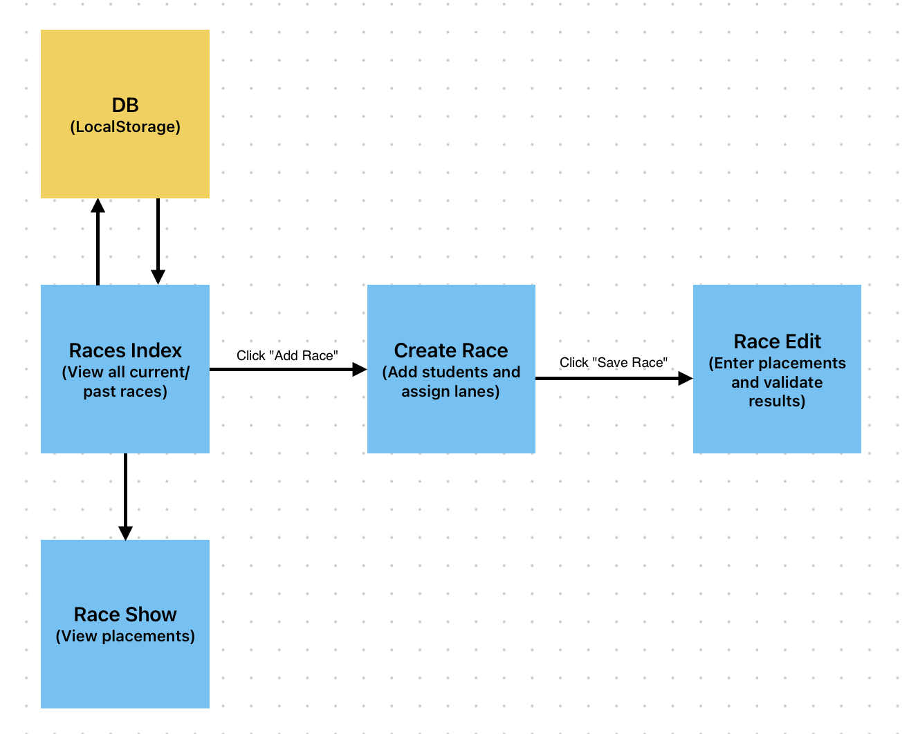

# Liveheats Race Management App - Requirements

## **📌 Overview**
This project is a **browser-based race management system** that allows teachers to:
- Create races with **unlimited participants**.
- Assign students to unique lanes via a **dropdown selection**.
- Record race results while ensuring **valid ranking logic**.
- View a historical **index of all races** stored in **localStorage**.
- **Edit race placements** after creation.
- **View race results** on a dedicated page.

---

## **📌 Core Features & Requirements**

### **1️⃣ Races Index (`/`)**
✅ Displays a **list of all past races** (persisted in localStorage).  
✅ Includes an **"Add Race" button** to create a new race.  
✅ Clicking a race navigates to **its results page (`/races/:id`)**.  

---

### **2️⃣ Race Creation (`/races/new`)**
✅ **Unlimited participants** – the UI should not cap race size.  
✅ **Student name input field** to add participants.  
✅ **Dropdown for lane selection**, dynamically disabling **already assigned lanes**.  
✅ Prevent duplicate **lane assignments**.  
✅ Clicking **"Save Race"** saves the race to **localStorage**.  

---

### **3️⃣ Race Edit (`/races/:id/edit`)**
✅ Displays **students and their assigned lanes**.  
✅ Allows teachers to **input and modify placements**, ensuring:  
   - No gaps in rankings (e.g., `1, 2, 4` is **invalid**).  
   - Correct handling of **ties** (e.g., `1, 1, 3` instead of `1, 1, 2`).  
✅ Saves **updated results to localStorage**.  

---

### **4️⃣ Race Show (`/races/:id`)**
✅ Displays the **final race results**.  
✅ Clearly indicates **ties and placements**.  

---

## **📌 Technical Considerations**
### **📍 Storage & State Management**
- **Use `localStorage`** to persist race data.
